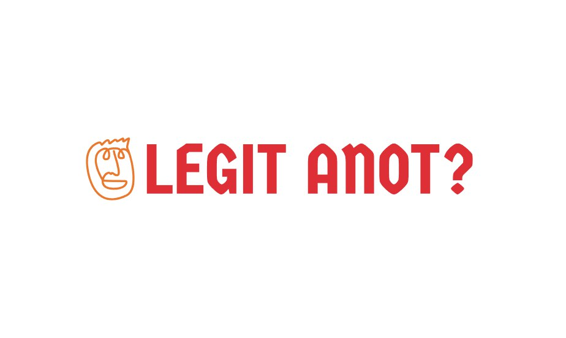

# YouthxHack 2024

<a id="readme-top"></a>


<!-- PROJECT LOGO -->
<br />
<div align="center">
  <a href="https://github.com/enjiawu/youthxhack">
    
  </a>

  <h3 align="center">Legit anot?</h3>

  <p align="center">
    Ensuring safety and legitamacy of links
    <br />
    <a href="https://github.com/enjiawu/youthxhack"><strong>Explore the docs »</strong></a>
    <br />
    <br />
  </p>
</div>


<!-- TABLE OF CONTENTS -->
<details>
  <summary>Table of Contents</summary>
  <ol>
    <li>
      <a href="#about-the-project">About The Project</a>
      <ul>
        <li><a href="#built-with">Built With</a></li>
      </ul>
    </li>
    <li>
      <a href="#getting-started">Getting Started</a>
      <ul>
        <li><a href="#prerequisites">Prerequisites</a></li>
        <li><a href="#installation">Installation</a></li>
      </ul>
    </li>
    <li><a href="#acknowledgments">Acknowledgments</a></li>
  </ol>
</details>


<!-- ABOUT THE PROJECT -->
## About Legit Anot?

Legit anot? is a comprehensive digital safety solution designed to enhance online trust and security. Our core offering is a website and its corresponding Chrome extension, developed to simplify the process of verifying the legitimacy of digital content, such as links. Whether you're searching on the website or using our extension, Legit Anot ensures that you can confidently distinguish between genuine and fraudulent interactions.

Website Features:
- Instant Link Analysis: Input any link into our website to receive a detailed score rating, reflecting its safety and legitimacy.
- User Contributions: Users can provide their own reviews on websites, which influences the overall score and fosters a collaborative safety environment.
- Detailed Dashboard: Access an in-depth analysis of the score, including metrics like SSL certification, site traffic, user votes, and more.

Chrome Extension:
- Automatic Checks: The extension evaluates the legitimacy of any link you click on in real-time. If a website is flagged as potentially unsafe, you'll see a score rating and have the option to view more details or proceed with caution.
- Customizable Protection Levels: Upon installation, users can select their preferred level of protection (low, medium, high) and grant permission to obtain their IP address to improve algorithm accuracy.
- Proactive Alerts: Users are prompted to review the safety of sites they visit, and their feedback is integrated into our system for enhanced future protection.

Future Developments:
- User Accounts: Implementing SingPass/World ID integration to offer secure account management and privacy.
- Expansion to Other Browsers: Extending the extension to support additional browsers like Safari and Edge.
- Expanded Detection: Exploring capabilities to detect fraudulent content in text messages and other communication channels.

By offering both a website and a browser extension, Legit anot? aims to make online safety accessible and effortless for users of all technical levels. Our solution provides a proactive approach to digital security, helping users confidently navigate their online interactions and protect themselves from various forms of digital scams.

<p align="right">(<a href="#readme-top">back to top</a>)</p>


### Built With


* [![React][React.js]][React-url]
* [![Bootstrap][Bootstrap.com]][Bootstrap-url]

<p align="right">(<a href="#readme-top">back to top</a>)</p>


<!-- GETTING STARTED -->
## Getting Started

To get a local copy up and running follow these simple example steps.

### Prerequisites

* npm
  ```sh
  npm install
  ```

### Installation

Follow these steps to set up and run the project:

### 1. Get API Keys

- Obtain a free API key for [Gemini AI](https://aistudio.google.com/app/apikey?_gl=1*mw1mhv*_ga*MTg2MjExNjU4OC4xNzI1MTY3NzQ0*_ga_P1DBVKWT6V*MTcyNTI4MTQ3Ni40LjEuMTcyNTI4MTQ5MS40NS4wLjQzODYyMDk2MA..).
- Obtain an API key for [Google Safe Browsing](https://developers.google.com/safe-browsing/v4/lookup-api).

### 2. Clone the Repository

```sh
git clone https://github.com/enjiawu/youthxhack.git
```
### 3. Install Backend Dependencies

1. Change directory to the API folder:

    ```sh
    cd youthxhack/API
    ```

2. Install NPM packages:

    ```sh
    npm install
    ```

3. Start the backend server:

    ```sh
    node server.js
    ```

### 4. Configure API Keys

- Open `config.js` in the API folder and replace the placeholder values with your API keys:

### 5. Install Frontend Dependencies

1. Change directory to the React frontend folder:

    ```sh
    cd ../legit-anot
    ```

2. Install NPM packages:

    ```sh
    npm install
    ```

### 6. Start the React Application

```sh
npm start
```


<p align="right">(<a href="#readme-top">back to top</a>)</p>


<!-- ACKNOWLEDGMENTS -->
## Acknowledgments

* [GitHub AdminLTE](https://github.com/ColorlibHQ/AdminLTE)
* [SimilarWeb Digital Suite](https://pro.similarweb.com/#/digitalsuite/home)

<p align="right">(<a href="#readme-top">back to top</a>)</p>


<!-- MARKDOWN LINKS & IMAGES -->
<!-- https://www.markdownguide.org/basic-syntax/#reference-style-links -->
[React.js]: https://img.shields.io/badge/React-20232A?style=for-the-badge&logo=react&logoColor=61DAFB
[React-url]: https://reactjs.org/
[Bootstrap.com]: https://img.shields.io/badge/Bootstrap-563D7C?style=for-the-badge&logo=bootstrap&logoColor=white
[Bootstrap-url]: https://getbootstrap.com